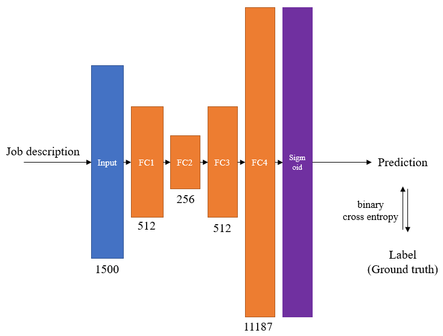
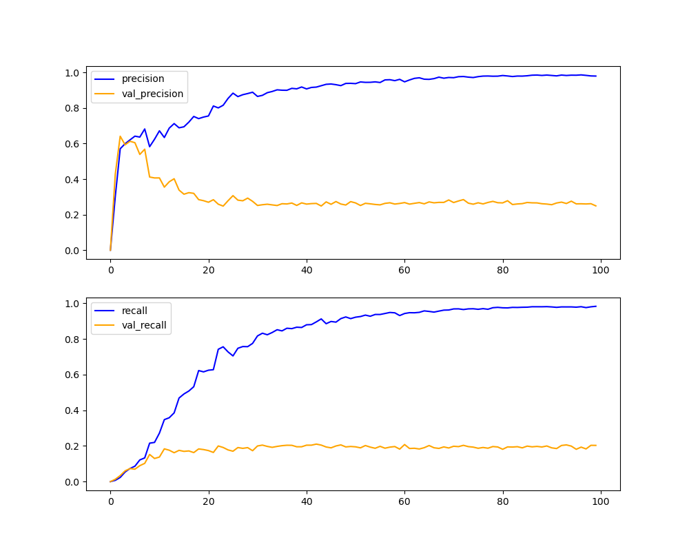
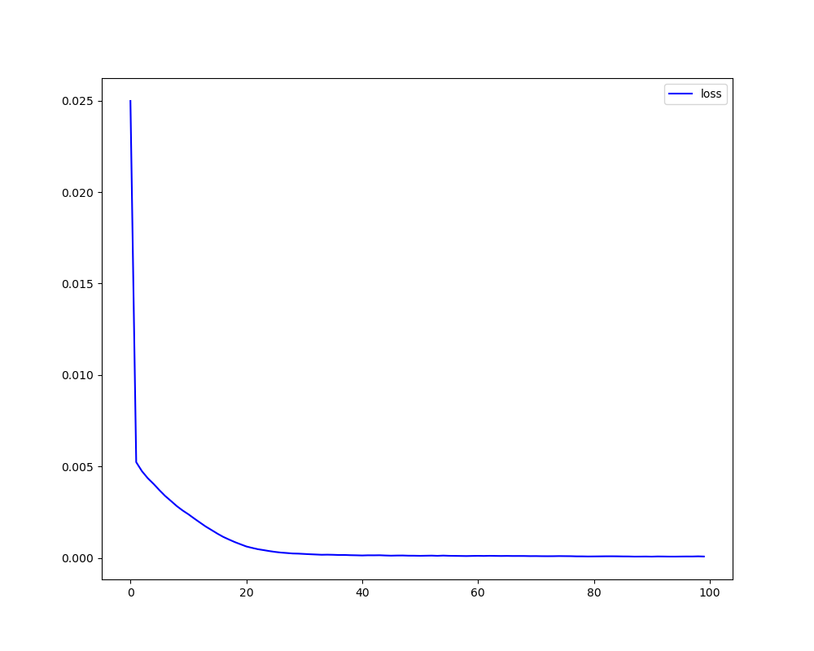

# multi-label-text-classification
【Demo】多标签文本分类

*说明：数据集仅包含数十行示例数据*

# 如何使用

### 数据预处理

```shell
python prepare_data.py
```

### 训练和评估模型

```shell
python train.py
```

### 使用训练好的模型进行预测

```shell
python predict.py
```

# 说明

### 模型结构



### 训练过程（特征维度1500、数据量1w）

|                      precision & recall                      |                             loss                             |
| :----------------------------------------------------------: | :----------------------------------------------------------: |
|  |  |

### 更多的实验尝试

| 序号  | 全连接层数 | 训练集数量 | 验证集数量 | 特征维度 | precision  | recall     |
| ----- | ---------- | ---------- | ---------- | -------- | ---------- | ---------- |
| 1     | 1          | 1k         | 500        | 800      | 0.5135     | 0.0464     |
| 2     | 1          | 1k         | 500        | 1500     | 0.5842     | 0.0480     |
| 3     | 4          | 1k         | 500        | 800      | 0.2123     | 0.1124     |
| 4     | 4          | 1k         | 500        | 1500     | 0.2193     | 0.1164     |
| 5     | 4          | 9k         | 1k         | 800      | 0.2949     | 0.1765     |
| 6     | 4          | 9k         | 1k         | 1500     | 0.2560     | 0.1894     |
| **8** | **4**      | **9w**     | **1w**     | **1500** | **0.7559** | **0.5989** |

